# Smarter Kettle ESPHome Retrofit

Welcome to the open-source ESPHome retrofit for the "Smarter" brand connected kettle. This project completely replaces the proprietary, cloud-dependent microcontroller with an ESP32 (Wemos D1 Mini32), providing 100% local control through Home Assistant. 

This repository (licensed under GPLv3) contains everything you need to hardware-mod the kettle base and flash the custom ESPHome firmware to achieve a stable, production-ready smart appliance with persistent settings, safety interlocks, and custom RTTTL buzzer melodies.

---

## Hardware Overview

### The Jug
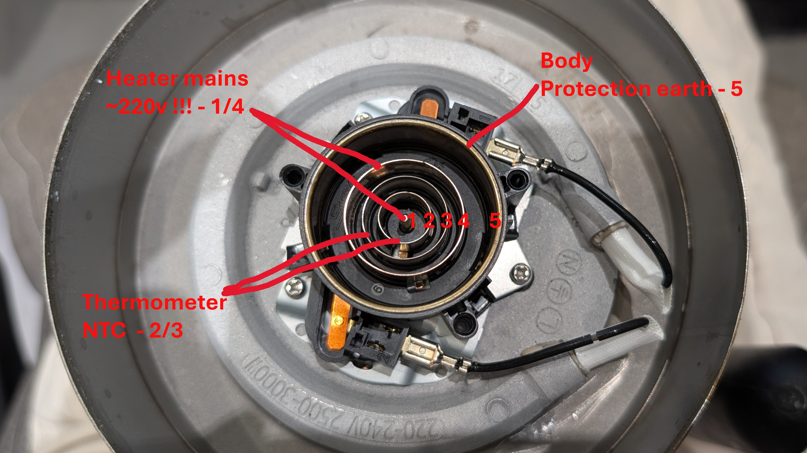
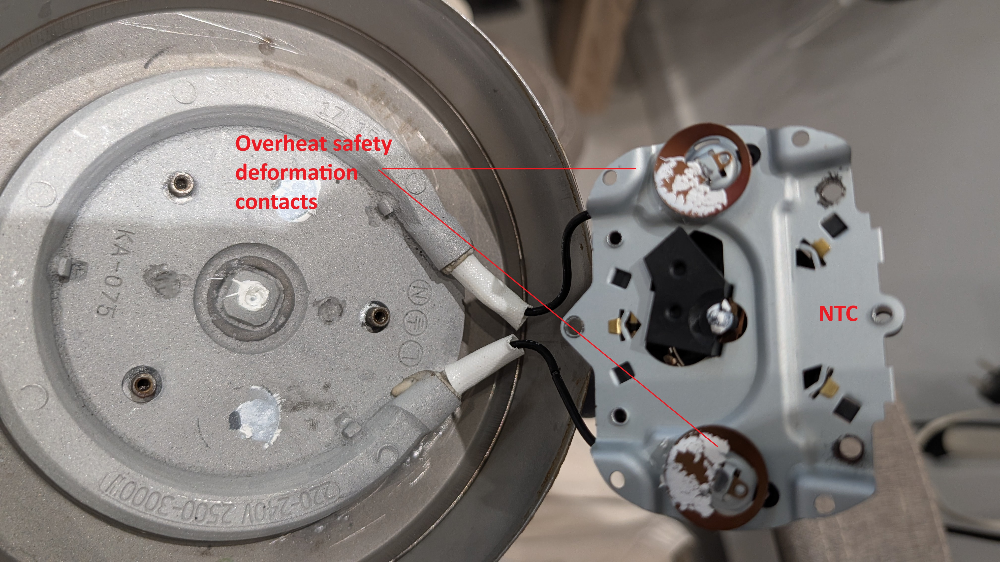

The kettle jug itself contains the high-voltage heating element and a low-voltage 50kΩ NTC thermistor. Power and sensor readings are transmitted through the concentric metal rings on the bottom of the jug. 
> **Note:** You do not need to disassemble the jug for this project. These images are strictly for your understanding of how the base communicates with the jug.

### The Kettle Base
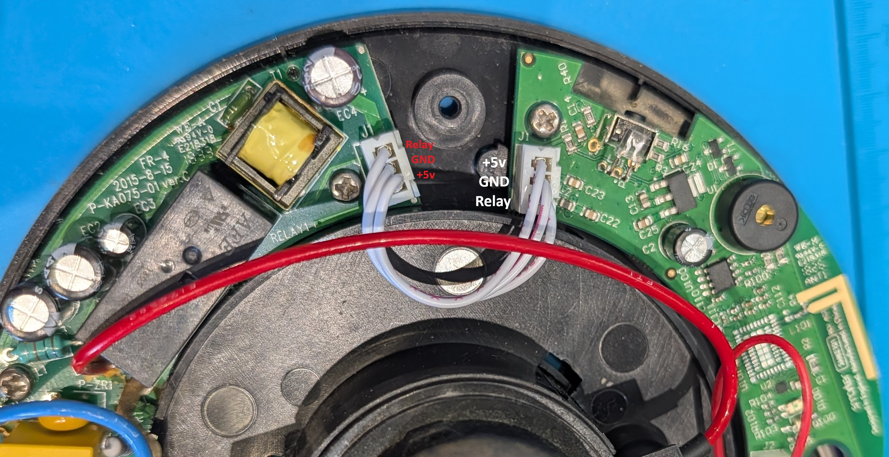

Inside the base, the electronics are divided into two distinct sub-boards connected by a JST jumper cable:
1. **High-Voltage Power Board:** Handles the AC mains switching via a mechanical relay.
2. **Low-Voltage Logic Board:** Contains the MCU, scale amplifier, buzzer, button, and LEDs.

### Main PCB
Here are the reference shots of the low-voltage logic board where all the modification work takes place.
* **Front:** 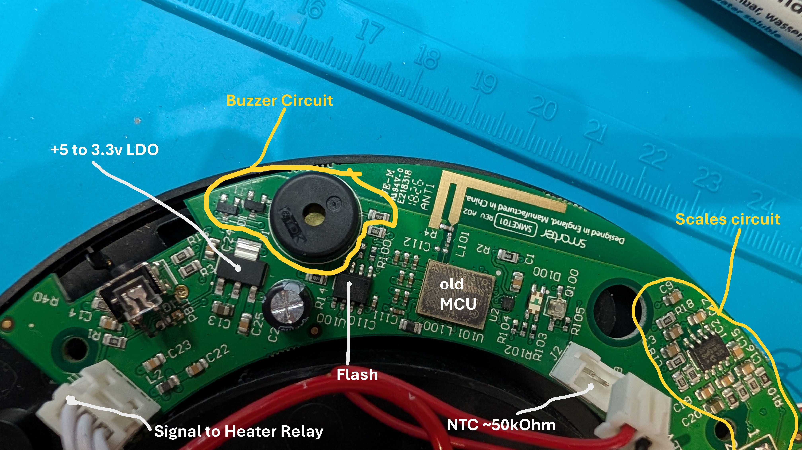
* **Back:** 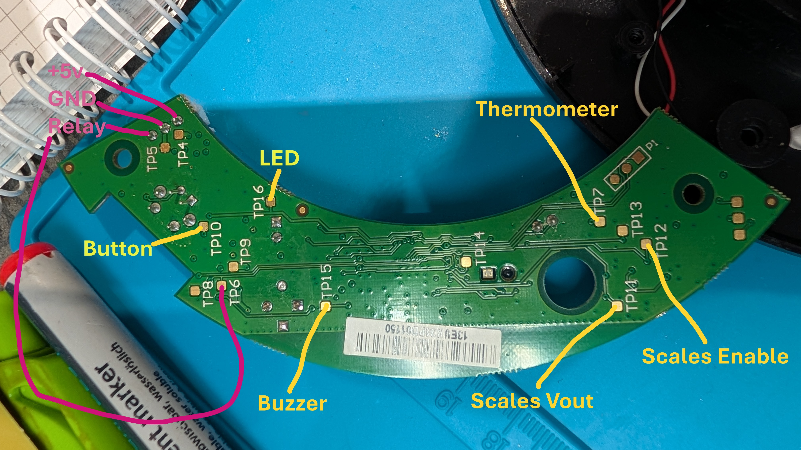

---

## Sensor Systems & Schematics
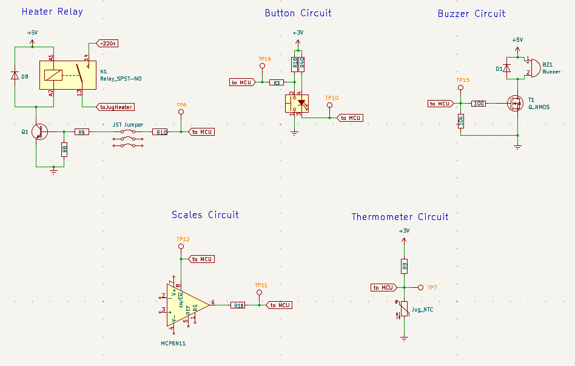

Before modifying the board, you should understand the two main sensor pipelines:
* **Temperature & Safety (NTC):** Acts as both the temperature sensor and a physical "Jug Present" safety interlock. If the jug is lifted, the electrical circuit breaks, and the ESP32 instantly shuts off the heating relay.
* **Volume/Weight (Load Cell):** The kettle sits on a load cell fed into an MCP6N11 Instrumentation Amplifier (INA). 

---

## Modding Instructions

Follow these steps to retrofit your kettle's logic board. 

### 1. Remove the Original MCU
Using a hot air rework station, carefully heat and desolder the original proprietary microcontroller from the logic board. Clean the pads with solder wick once removed.
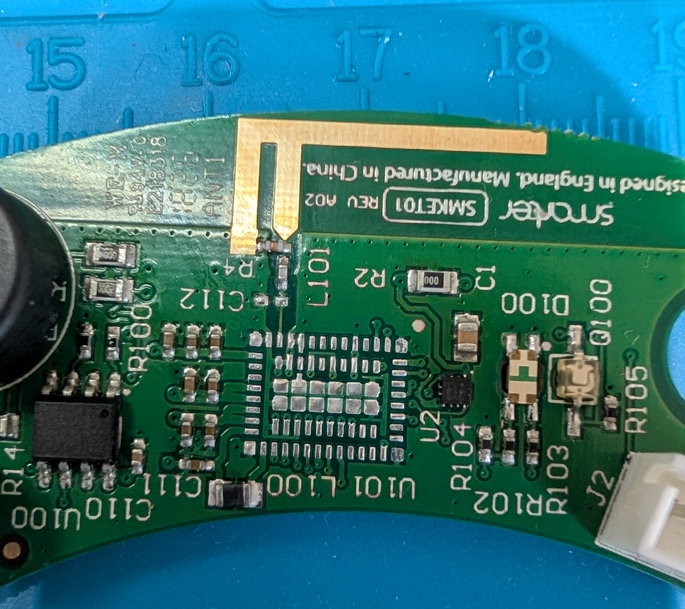

### 2. Choose Your Microcontroller
You can technically use an ESP8266 for this project, but **it is not recommended**. The ESP8266 only has a single analog-to-digital converter (ADC), meaning you would only be able to read the temperature and you would lose the scale functionality. 

We highly recommend using an **ESP32** (like the Wemos D1 Mini32 used in this guide) because it features multiple ADCs, allowing you to read both the NTC temperature sensor and the load cell simultaneously.
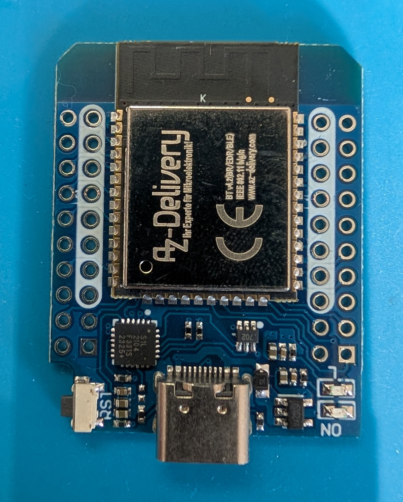

### 3. Wire the ESP32 to the Test Points
Mount your ESP32 and wire it to the exposed test points on the Smarter logic board. Use the following table to map the kettle's schematic test points to the correct ESP32 GPIO pins configured in the firmware.

| Kettle Function | Schematic Test Point | ESP32 GPIO | Description |
| :--- | :--- | :--- | :--- |
| **Scale Power (EN/CAL)** | `TP12` | `GPIO16` | Triggers the INA amplifier calibration and powers the scale. |
| **Base Button** | `TP16` | `GPIO17` | Physical button input (inverted, internal pull-up). |
| **Buzzer** | `TP15` | `GPIO19` | PWM output for RTTTL melodies. |
| **Button LED** | `TP10` | `GPIO21` | Illuminates the ring around the button. |
| **Heating Relay** | `TP6 OR JST pin` | `GPIO22` | Triggers the high-voltage relay to boil the water. |
| **NTC Sensor** | `TP7` | `GPIO33` | Analog temperature and jug presence reading. |
| **Weight Sensor** | `TP11` | `GPIO35` | Analog output from the MCP6N11 INA. |

*(Please verify the exact test point labels against your specific schematic version).*

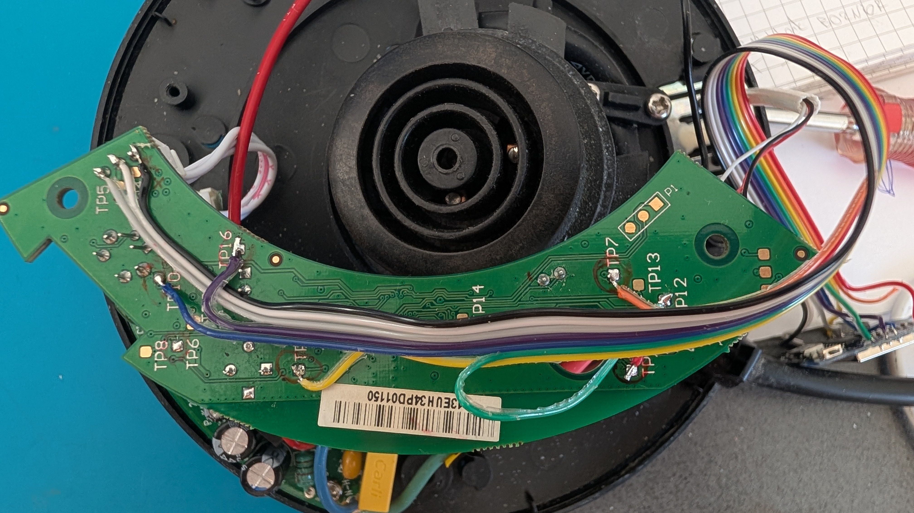

### 4. Hardware Test Firmware
Before sealing everything up, use the provided `test code_Kettle_ESP32_v1.txt` file to quickly verify your soldering and hardware[cite: 2]. This minimal ESPHome configuration will:
* Toggle the Button LED and log the live temperature, volume, button state, and relay state to your console every 1 second[cite: 2].
* Play a short beep and manually engage the heating element while you hold the physical button down[cite: 2].

### 5. Modify the Scales Circuit
To get clean readings from the MCP6N11 instrumentation amplifier, you need to bypass a high-resistance path that causes severe RC-delay and voltage drift. Locate **R18** on the PCB and bridge it with solder (short it out).

* **Before:** 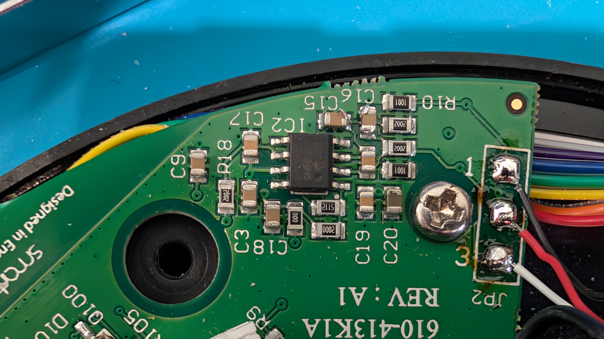
* **After:** 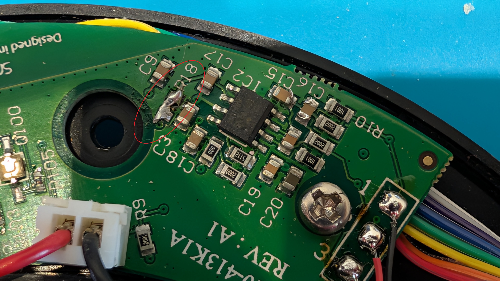

> **⚠️ Disclaimer:** The load cell and scale circuit are highly sensitive. Even with the R18 bypass and pulsed calibration routines in the firmware, the scale readings are currently experimental and may experience drifting under static load. Further tuning of the ESPHome interval logic is ongoing.

---
### 5. Software

I added single and double-click settings for different boil temperatures. Defaults are 85*C for single and 95*C for double click. You can modify these values through HA.

Long 10sec button hold will reset the wifi and other settings and enable the Access Point for direct connection.

Add the device in your Home Assistant ESPHome Builder.

## Features: Melodies & Tones
Why settle for standard beeps? The custom firmware includes an integrated RTTTL engine utilizing the kettle's built-in buzzer. By default, the kettle will play a standard double-beep when boiling finishes, but on every **3rd completed boil**, it will randomly select and play a fun melody (like Mario, Tetris, or the Imperial March) to celebrate!

## Firmware Installation

Once the hardware modifications are complete and tested, head over to the [ESPHome Code](ESPHome%20Code/Smart%20Kettle%20-%20ESPHome.yaml) directory in this repository. Flash the provided full YAML configuration to your ESP32 to integrate the kettle with Home Assistant.

---

## Final Result

Once reassembled, you have a completely local, lightning-fast smart kettle seamlessly integrated into your smart home ecosystem!

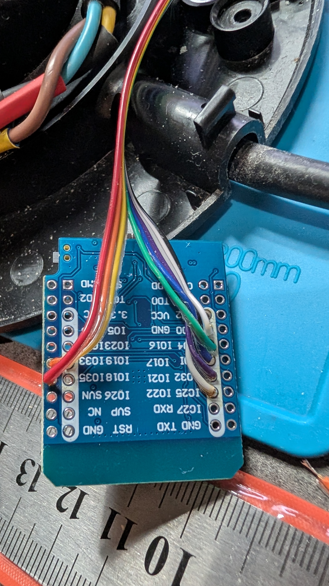
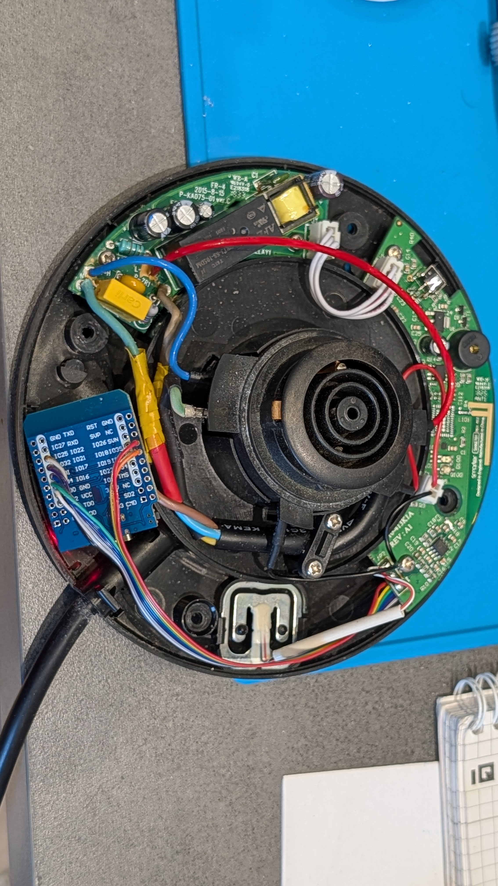