# Smarter Kettle ESPHome Retrofit


Welcome to the open-source ESPHome retrofit for the "Smarter" brand connected kettle. This project completely replaces cloud-dependent microcontroller with an ESP32, providing 100% local control through Home Assistant. 

This repository (licensed under GPLv3) contains everything you need to hardware-mod the kettle base and flash the custom ESPHome firmware to achieve a stable, production-ready smart appliance with persistent settings, safety interlocks, custom RTTTL buzzer melodies and my lerned lessons.

---

## Hardware Overview

### The Jug
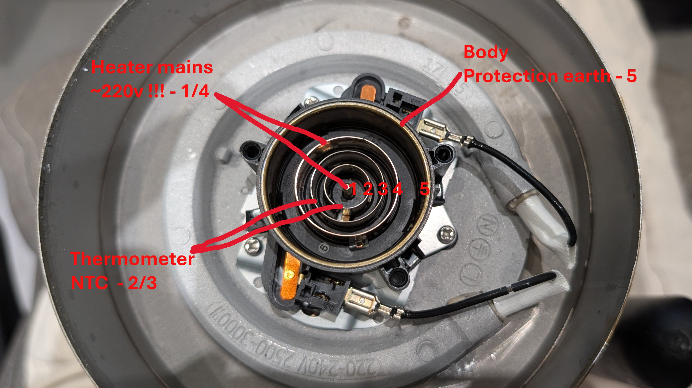
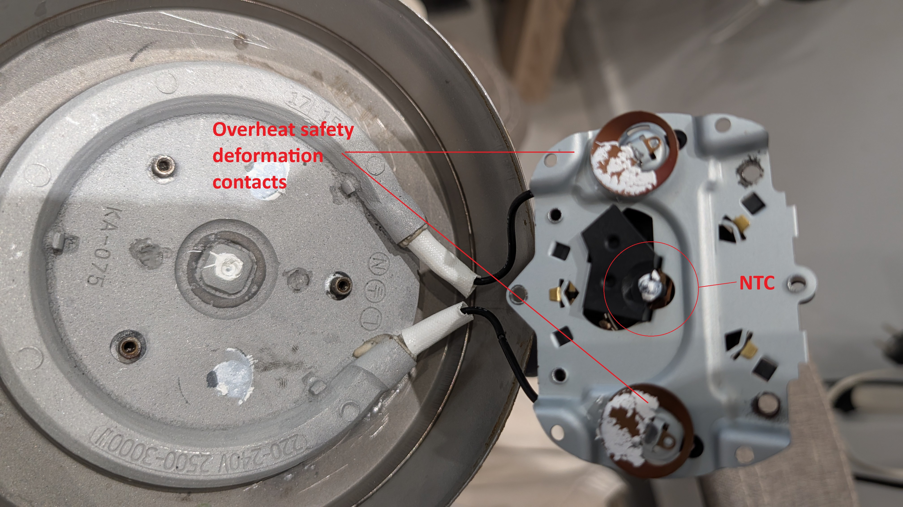

The kettle jug itself contains the high-voltage heating element and a low-voltage 50kΩ NTC thermistor. Power and sensor readings are transmitted through the concentric metal rings on the bottom of the jug. 
> **Note:** You do not need to disassemble the jug for this project. These images are strictly for your understanding of how the base communicates with the jug.

### The Kettle Base
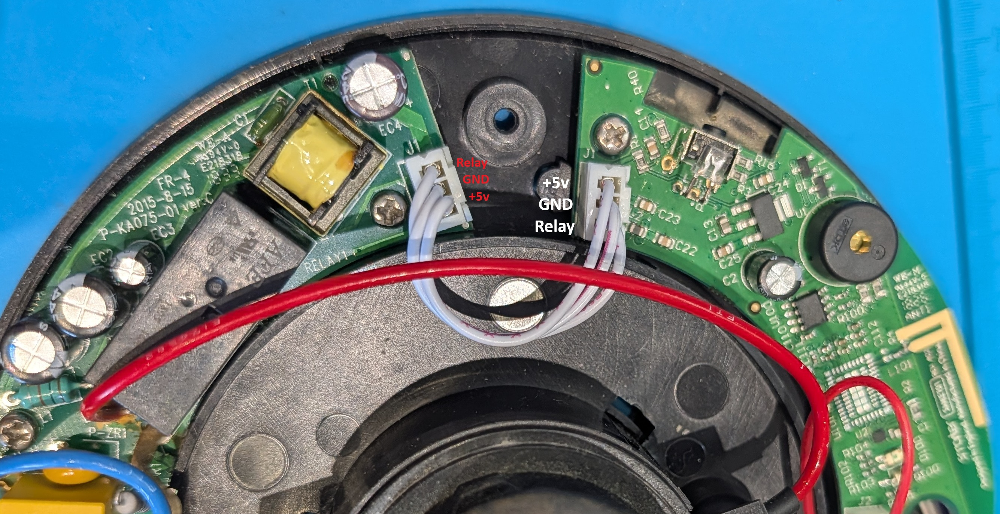

Inside the base, the electronics are divided into two distinct sub-boards connected by a JST jumper cable:
1. **High-Voltage Power Board:** Handles the AC mains switching via a mechanical relay.
2. **Low-Voltage Logic Board:** Contains the MCU, scale amplifier, buzzer, button, and LEDs.

### Main PCB
Here are the reference shots of the low-voltage logic board where all the modification work takes place.
* **Front:** 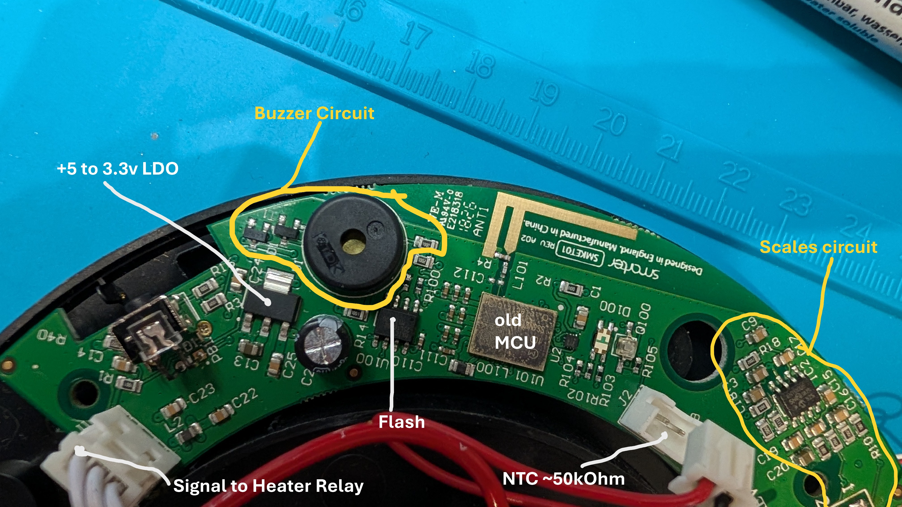
* **Back:** 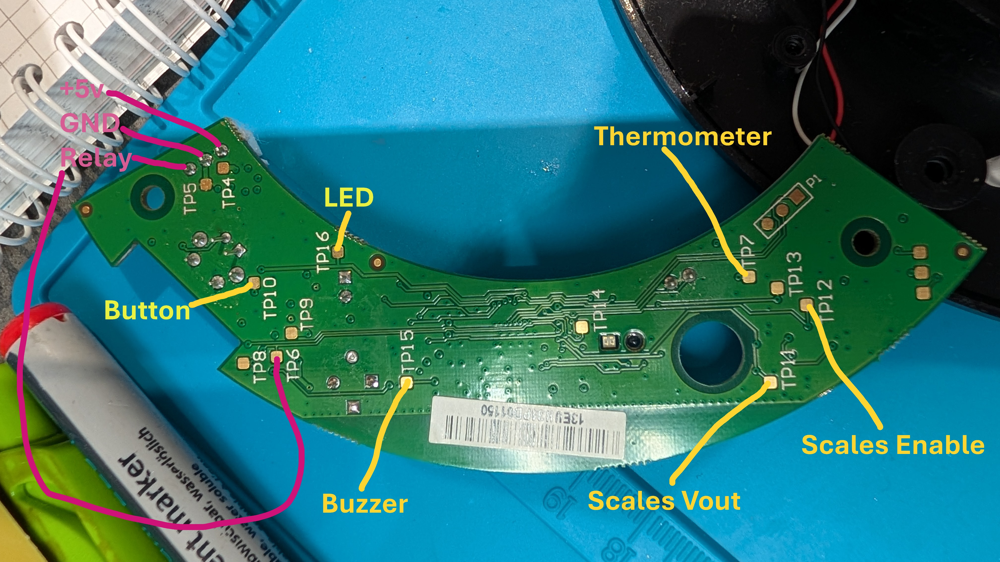

---

## Sensor Systems & Schematics
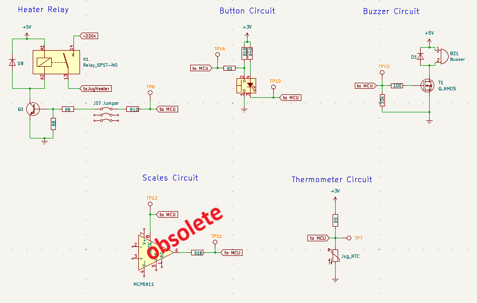

Before modifying the board, you should understand the two main sensor pipelines:
* **Temperature & Safety (NTC):** Acts as both the temperature sensor and a physical "Jug Present" safety interlock. If the jug is lifted, the NTC electrical circuit breaks and the ESP32 instantly shuts off the heating relay.
* **Water volume/Weight (Load Cell):** The kettle sits on a load cell fed into an MCP6N11 Instrumentation Amplifier (INA). This INA brings the analog voltage to MCU ADC pin. If this voltage is in anyway changed on it's way to ESP, the readings will fail or drift, like in my case. I replaced the whole scale circuit with HX711 circuit. HX711 does all analogic conversions internally and wires out a stable digital square wave.

---

## Modding Instructions

Follow these steps to retrofit your kettle's logic board. 

### 1. Remove the Original MCU
Using a hot air rework station, carefully heat and desolder the original proprietary microcontroller from the logic board. Since you don't care if you damage it, overheating or some mechanical damage is not an issue.
Clean the pads with solder wick once removed.
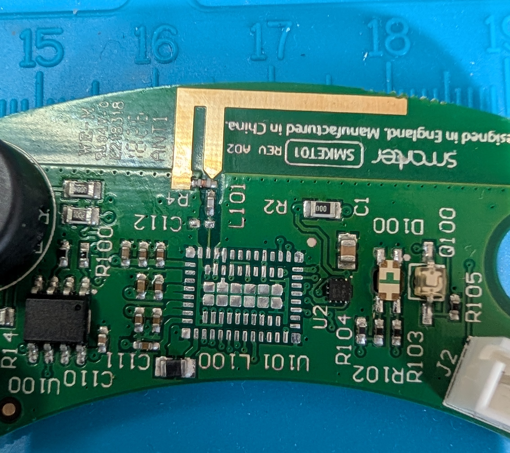

### 2. Choose Your Microcontroller
Before i decided to ditch the existing Scale MCP6N11, I needed two ADC (Analog-to-Digital Converter) pins on ESP: 
- for reading raw voltage from NTC Thermistor
- for reading the raw voltage coming from INA. 

ESP8266 has only **ONE** ADC pin. 

With HX711 you need two extra GIOs and only one ADC pin for temperature. In this setup you can use an ESP8266 for this project. 

We will be using an **ESP32 Wemos D1 Mini32** (because i was too lazy to resolder everything back to ESP8266 :-)  ).
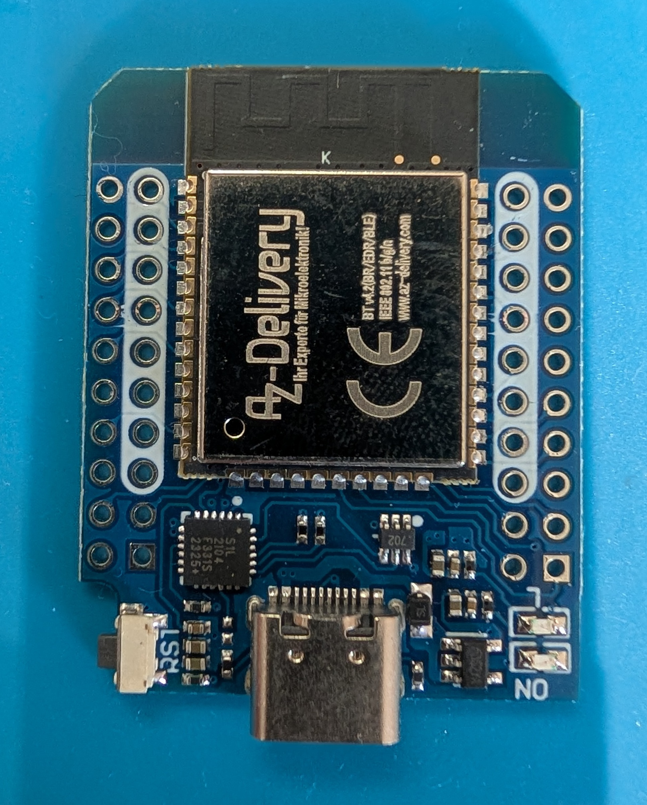

### 3. Wire the ESP32 to the Test Points
The original kettle board is reused (except for scales circuit). Mount your ESP32 and wire it to the exposed Test Points (TP) on the Smarter logic board. Use the following table to map the kettle's schematic test points to the correct ESP32 GPIO pins configured in the firmware.

| Kettle Function | Schematic Test Point | ESP32 GPIO | Description |
| :--- | :--- | :--- | :--- |
| **Base Button** | `TP16` | `GPIO17` | Physical button input (inverted, internal pull-up). |
| **Buzzer** | `TP15` | `GPIO19` | PWM output for RTTTL melodies. |
| **Button LED** | `TP10` | `GPIO21` | Illuminates the ring around the button. |
| **Heater Relay** | `TP6 OR JST pin` | `GPIO22` | Triggers the high-voltage relay to boil the water. |
| **NTC Sensor** | `TP7` | `GPIO34` | Analog temperature and jug presence reading. |
| **HX711 DT** |  | `GPIO33` | HX711 Data. |
| **HX711 SCK** |  | `GPIO18` | HX711 CLock. |
| **3.3v** | `TP9` |  |  3.3v from 5-to-3.3v LDO |
| ~~**Scale Power (EN/CAL)**~~ | ~~`TP12`~~ | ~~`GPIO16`~~ | ~~Triggers the INA amplifier calibration and powers the scale.~~|| ~~**Weight Sensor**~~ | ~~`TP11`~~ | ~~`GPIO35`~~ | ~~Analog output from the MCP6N11 INA.~~ |
| ~~**Weight Sensor**~~ | ~~`TP11`~~ | ~~`GPIO35`~~ | ~~Analog output from the MCP6N11 INA.~~ |


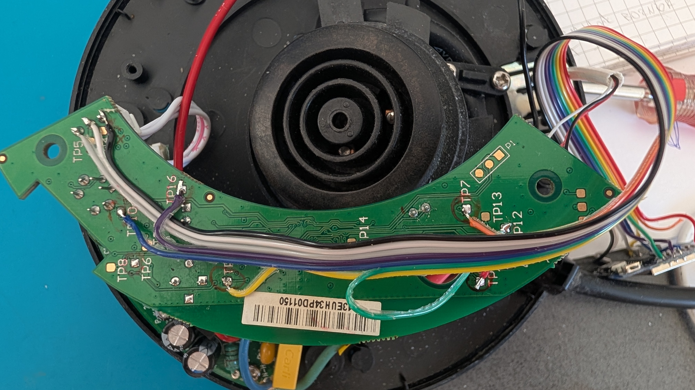

### 4. Hardware Test Firmware
Before sealing everything up, I used the provided `test code_Kettle_ESP32_v1.txt` file to quickly verify my soldering and hardware. This minimal ESPHome configuration will:
* Toggle the Button LED and log the live temperature, volume (old scales circuit), button state, and relay state to your console every 1 second.
* Play a short beep and manually engage the heating element while you hold the physical button down.

>Note: this test code does **not include** HX711 tests but includes the, now obsolete, MCP6N11 tests. It needs a little updates.

### 5. Modify the Scales Circuit
I tried to reuse the existing INA IC and curcuit to read the load cell. Sadly it drifted slowly and was very unreliable after some time. The reason could be my poor reverse-engineering, or the wires picking up noise. I decided to use HX711 IC because it handles the analogic voltage amplification and measurement inside the IC.
The original MCP6N11 sent the raw voltage variations to the MCU and the MCU should judge the weight by the tiny voltage changes on the ADC pin.

HX711 communicates over 3.3v digital signals to ESP. It can go 5v, but ESP limits the direct IO on the pins to 3.3v.

Use the below diagram and use the same resistors type/batch/size. Check how i [screwd it up](#f2-hx711-load-cell-resistors)


 
 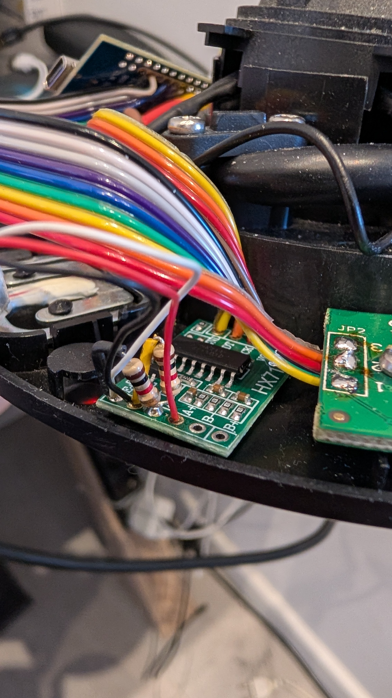


---
##  Software

I added single and double-click settings for different boil temperatures. Defaults are 85*C for single and 95*C for double click. You can modify these values through HA.

Long 10sec button hold will reset the wifi and other settings and enable the Access Point for direct connection.

- Add the device in your Home Assistant ESPHome Builder and flash ESPHome.
- add Secrets for your Wifi in HA to avoid having the wifi pass on the yaml. Check the three-dot menu in the ESPHome Device Builder.
- [Calibrate](#f3-calibration-of-hx711) your scales

### Features: Melodies & Tones
Why settle for standard beeps? The custom firmware includes an integrated RTTTL engine utilizing the kettle's built-in buzzer. By default, the kettle will play a standard double-beep when boiling finishes, but on every **3rd completed boil**, it will randomly select and play a fun melody (like Mario, Tetris, or the Imperial March) to celebrate!

### Firmware Installation

Once the hardware modifications are complete and tested, head over to the [ESPHome Code](ESPHome%20Code/Smart%20Kettle%20-%20ESPHome.yaml) directory in this repository. Flash the provided full YAML configuration to your ESP32 to integrate the kettle with Home Assistant.

---

# Final Result

Once reassembled, you have a completely local, lightning-fast smart kettle seamlessly integrated into your smart home ecosystem!

The beauty also lies in the full reuse on the existing PCB boards.


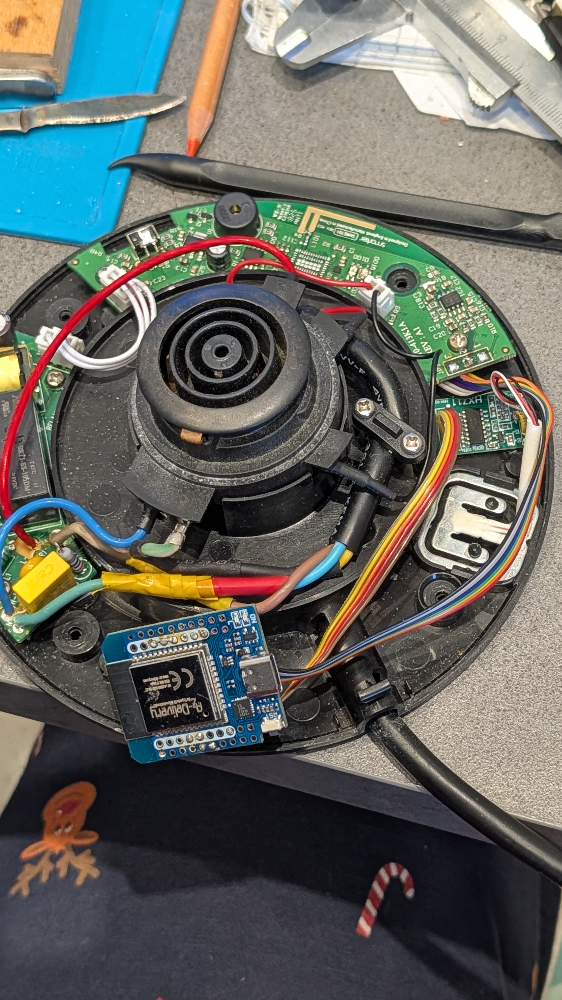


## My fails and Lessons Learned

### f1. original Analog Scales circuit
I did a pretty good-ish job reverse engineering the existing board so no PCB worksare required. But the scales inthe wnd were giving too unstable readings so i had tomove to HX711.
Instrument Amplifier will take tiny voltagechanges on the cell and send themto ADC pin. The MCU should extrapolate the weight change based on the voltage change. If noise gets on this circuit - good luck.
The shorter the analog path - the better.
[Original Scales](photos/scales_after.jpg)

### f2. HX711 Load cell resistors
HX711 can connect many load cells, but in our case we have only one cell that has three wires. The diagram requires us to use two 1k ohm resistors. To be fancy i reused a 0603 SMD resistor from an older device, as it fits perfectly between 2.54mm pins and a normal 0.125W THT resistor. 

The difference in power rating and thermal curves added a big drift in the cell wight readings. It just could not stop in a usable range.
At least is looked cool, for a while :)

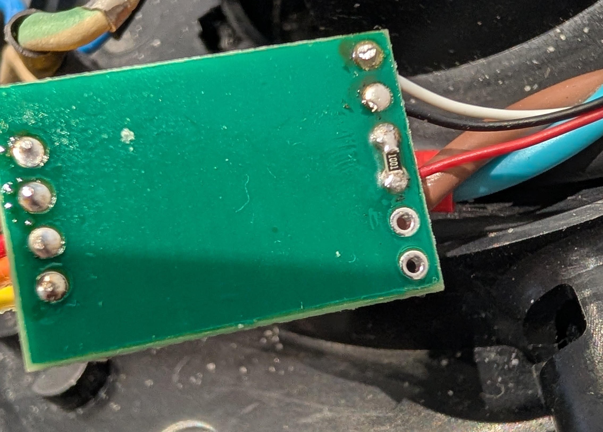
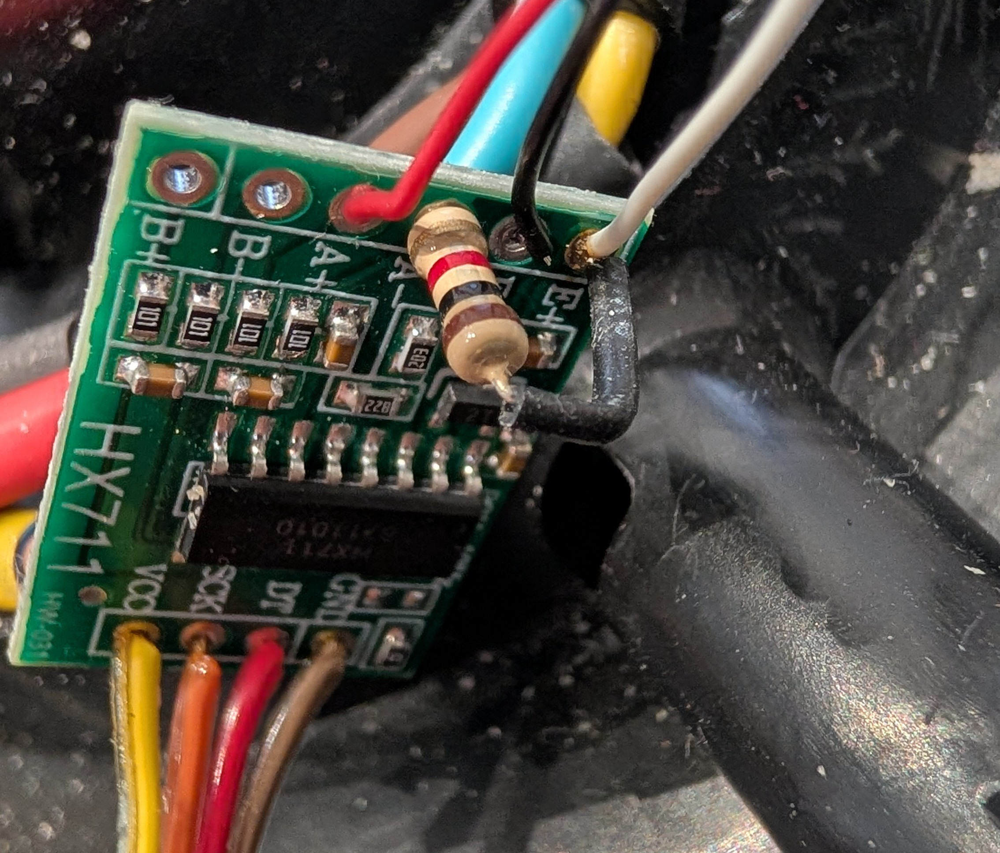


### f3. Calibration of HX711

in the Devices -> ESPHome -> SmartKettle you can observe realtime the value the HX711 is returning.

I created a spreadsheed with two colums: empty and 1.5L of water.

Now over the course of 30-60 minutes i was randomly recording the value of the raw scale output. This allowed me to make an average for "empty" and "full" jug.
mind that the values are negative.

After you have the values, you can use calibration input fields on HA or just hardcode them in the code

```
  - platform: template
    name: "Calibration: Empty Value"
    id: cal_empty_value
    optimistic: true
    min_value: -10000000
    max_value: 10000000
    step: 1
    restore_value: true
    initial_value: -4448800
    entity_category: diagnostic
    set_action:
      - lambda: 'id(cal_empty_value).publish_state(x);'

  - platform: template
    name: "Calibration: Full Value"
    id: cal_full_value
    optimistic: true
    min_value: -10000000
    max_value: 10000000
    step: 1
    restore_value: true
    initial_value: -4688800
    entity_category: diagnostic
    set_action:
      - lambda: 'id(cal_full_value).publish_state(x);'
```


Happy tinkering,
dru

